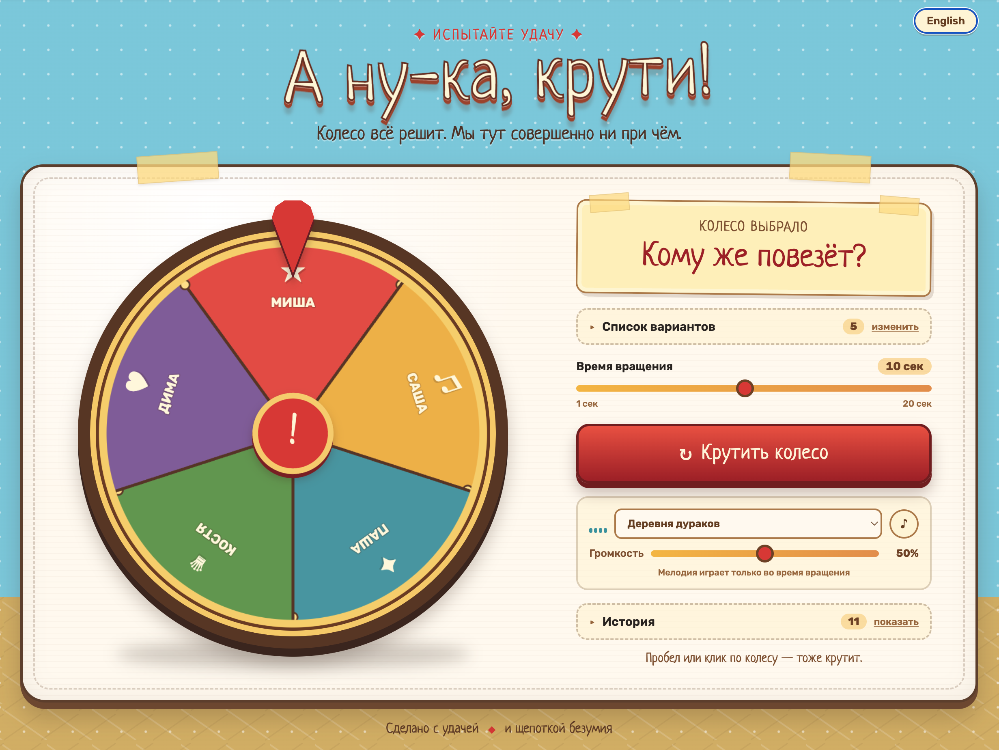

# 🎡 Колесо фортуны

Статичный сайт-рандомайзер: колесо с настраиваемым списком вариантов.
Само колесо работает без сборки: чистые HTML/CSS/JS. Для аналитики
используется отдельный коллектор на Node.js и SQLite.

**Открыть приложение:** [wheel.rprokhorov.ru](https://wheel.rprokhorov.ru/)



## Запуск

```bash
open index.html
# или локальный сервер:
python3 -m http.server 8000 -d .
```

## Возможности

- Редактирование списка в текстовом поле: по одному варианту на строке
  (дубликаты отсеиваются, максимум 30 вариантов)
- Перемешивание списка
- После каждого розыгрыша сайт спрашивает, удалить победителя или оставить
- История: последние 50 розыгрышей сохраняются, последние 20 показываются в интерфейсе
- **Длительность вращения** — ползунок от 1 до 20 секунд; выбранная мелодия играет во время вращения
- **Фоновая музыка** — три трека по 20 с: «Деревня дураков» (по умолчанию), «Ну, погоди!»
  и «Шоу Бенни Хилла», плюс громкость
- **Состояние в строке запроса** — список, музыка, длительность и настройки кодируются в URL
- Экспорт / импорт списка в JSON
- Конфетти, всплывающие подсказки и анимация стрелки
- Звук: тиканье при вращении + фанфары
- Список, настройки и история сохраняются в `localStorage`

## Горячие клавиши

| Клавиша | Действие |
|---|---|
| `Space` | Крутить колесо |
| `Esc`   | Закрыть диалог выбора |

## Структура

```
index.html      разметка
favicon.svg     иконка вкладки (плюс PNG-запасные варианты)
css/style.css   стили: палитра, карточка, колесо, диалог
js/app.js       логика: состояние, canvas-колесо, анимация, хранение
js/analytics.js клиентская отправка событий в коллектор
music/          аудиофайлы, поставляемые с сайтом
collector/      API, панель аналитики и SQLite
```

## Формат JSON для импорта

```json
["Вариант 1", "Вариант 2", "Вариант 3"]
```

## Параметры строки запроса

Состояние дублируется в адресе страницы и обновляется при каждом изменении.
Открыв такую ссылку, вы получите ту же раскладку — кнопка «Скопировать ссылку» отдаёт готовый адрес.

| Параметр   | Значения | Описание |
|---|---|---|
| `items`    | строки через запятую | список вариантов |
| `duration` | `1`–`20` | длительность вращения в секундах |
| `music`    | `kalambur`, `nupogodi`, `benny`, `none` | фоновая мелодия |
| `volume`   | `0`–`100` | громкость музыки |
| `sound`    | `1` / `0` | звуковые эффекты (тиканье, фанфары) |

Пример:

```
index.html?items=Пицца,Суши,Паста&duration=20&music=kalambur&volume=60&sound=1
```

URL важнее сохранённого состояния: если параметры есть в адресе, они переопределяют `localStorage`.
Длительность и громкость ограничиваются допустимым диапазоном; неизвестная
мелодия заменяется на вариант «Без музыки».


## Аудио

| Файл | Название в интерфейсе | Длительность |
|---|---|---|
| `music/kalambur.m4a`  | Деревня дураков | 20 с |
| `music/nu-pogodi.m4a` | Ну, погоди!     | 20 с |
| `music/benny-hill.m4a` | Шоу Бенни Хилла | 20 с |

Все три фрагмента в формате AAC. «Деревня дураков» выбрана по умолчанию;
длительность вращения по умолчанию — 20 секунд.

Чтобы добавить ещё трек, положите файл в `music/` и допишите строку в `TRACKS`
в `js/app.js`: `id: { name: 'Название', src: 'music/файл.m4a' }`.

## Развёртывание в Docker

Четыре сервиса: `site` (nginx со статикой), `collector` (API и SQLite),
`rollup` (ночной пересчёт агрегатов) и `caddy` (реверс-прокси с TLS от
Let's Encrypt). Наружу смотрит только Caddy, на портах 80 и 443.
`site` использует образ `wheel-of-fortune`, а `collector` и `rollup` — один
образ `wheel-collector` с разными командами запуска.

### На VPS

Требуется: DNS-запись `wheel.rprokhorov.ru` → IP этого VPS и открытые порты 80/443
(порт 80 нужен Let's Encrypt для проверки владения доменом).

```bash
git clone https://github.com/rprokhorov/wheel-of-fortune.git
cd wheel-of-fortune
cp .env.example .env
# В .env укажите домен, почту, уникальную ORG_SALT, DASH_PASS и TAG релиза.
# Не оставляйте значения-заглушки из примера.
docker compose pull site collector rollup
docker compose up -d
```

Образы сайта и коллектора подтягиваются готовыми из `ghcr.io` — собирать на
сервере не нужно.
Прод использует версионный тег `TAG` в `.env` (например, `v1.6.1`).
Перед тегом добавьте `docs/releases/vX.Y.Z.md` с изменениями и проверками.
После успешных тестов и сборки `main` выпустите тег и дождитесь публикации
обоих образов с этим тегом. После сборки GitHub Actions создаст Release из
этого файла и добавит ссылки на образы сайта и коллектора:

```bash
VERSION=vX.Y.Z # замените на новую версию
git tag -a "$VERSION" -m "Release $VERSION"
git push origin "$VERSION"
```

На VPS сделайте резервную копию базы и текущих образов, затем обновите `TAG`
в `.env` и контейнеры. Пример для следующего релиза:

```bash
cd wheel-of-fortune
git pull --ff-only
mkdir -p ../wheel-backups
cp -p .env "../wheel-backups/env.$(date -u +%Y%m%dT%H%M%SZ)"
sed -i 's/^TAG=.*/TAG=vX.Y.Z/' .env # подставьте опубликованный тег
docker compose pull site collector rollup
docker compose up -d --no-deps site collector rollup
```

Для отката верните прежний `TAG` и повторите `docker compose up -d --no-deps site collector rollup`.
Не удаляйте том `analytics_data`: в нём находится база событий.

Коммиты в `main` также публикуют `latest` и `sha-<commit>` для проверки,
но прод закреплён за конкретным релизом.

Проверка:

```bash
docker compose ps
docker compose logs -f caddy      # выпуск сертификата
curl -I https://wheel.rprokhorov.ru/
curl -s https://wheel.rprokhorov.ru/healthz
```

### Локально

```bash
docker compose up --build         # соберёт образ из исходников
```

Для проверки колеса без домена и TLS удобнее обычный статичный сервер:
`python3 -m http.server 8000 --bind 127.0.0.1`. Для локального Docker-запуска
с аналитикой также нужен заполненный `.env`; Caddy ожидает домен из `SITE_DOMAIN`.

### Переменные окружения

| Переменная | Назначение |
|---|---|
| `SITE_DOMAIN` | домен для сертификата и маршрутизации Caddy |
| `ACME_EMAIL`  | почта для уведомлений Let's Encrypt |
| `TAG`         | тег образа из ghcr.io (`latest` или конкретный) |
| `ORG_SALT` | постоянная соль для группировки событий по сети; после запуска не менять |
| `DASH_USER` / `DASH_PASS` | учётные данные панели аналитики |
| `IP_RETENTION_DAYS` | через сколько дней удалять IP из событий; `0` отключает очистку |

Сертификаты хранятся в томе `caddy_data` и переживают пересоздание контейнеров.

## Сборка образа

Workflow `.github/workflows/docker.yml` при каждом пуше в `main` собирает оба
образа для `linux/amd64` и `linux/arm64` и публикует их в
`ghcr.io/rprokhorov/wheel-of-fortune` и `ghcr.io/rprokhorov/wheel-collector`
с тегами `latest` и `sha-<короткий SHA>`. Теги вида `v*` дают одноимённые теги
образов и GitHub Release с описанием из `docs/releases/`.

## Оформление

Визуальная основа — «ярмарочная» стилистика: дневное небо с облаками, карточка из
плотной бумаги на скотче, деревянная оправа колеса, объёмные кнопки. Заголовки набраны
шрифтом Neucha, интерфейс — Rubik; оба подключаются с Google Fonts и имеют системный
фолбэк, поэтому без интернета вёрстка не ломается.

Анимации отключаются для тех, кто выставил в системе `prefers-reduced-motion`.

## Тесты

Два уровня: модульные и интеграционные проверки на Node.js, а также e2e в браузере.

```bash
npm ci
npm ci --prefix collector
npx playwright install chromium webkit

npm test              # проверки Node.js + e2e
npm run test:unit     # проверки Node.js
npm run test:e2e      # только e2e
npm run coverage      # покрытие проверок Node.js, локально
npm run test:report   # HTML-отчёт после e2e
```

**Проверки Node.js** используют `node:test`. Они проверяют
`js/core.js` (геометрия колеса, разбор ввода, состояние в URL, профиль
списка), `collector/lib.js` (нормализация событий, хеш сети, разбор UA)
и фильтры API коллектора с временной базой SQLite. Бегут быстро, поэтому
перебирают то, что e2e не осилит:
например, что победитель оказывается под указателем для всех размеров
списка и всех индексов сразу.

**E2E** — сценарии Playwright в двух окружениях: десктопный Chromium и
мобильный WebKit (iPhone 13) локально; в Linux CI мобильный Chromium (Pixel 7).
Локальный сервер поднимается автоматически, отдельно запускать не нужно.
Тесты открывают сайт с `?analytics=off`, поэтому не засоряют статистику.

| Файл | Что покрывает |
|---|---|
| `tests/wheel.spec.js` | вращение, блокировка кнопки, пробел и клик, история, диалог выбора |
| `tests/items.spec.js` | правка списка, дубликаты, разделители, лимит 30, экспорт, пустое колесо |
| `tests/settings.spec.js` | треки, громкость, эквалайзер, звуковые эффекты, длительность |
| `tests/url-lang.spec.js` | параметры ссылки, приоритет над хранилищем, переключение ru/en |
| `tests/unit/geometry.test.js` | углы, сектора, совпадение победителя с указателем |
| `tests/unit/parsing.test.js` | `clampInt`, разбор списка, чтение и сборка URL |
| `tests/unit/profile.test.js` | признаки списка без раскрытия содержимого |
| `tests/unit/collector.test.js` | хеш сети, разбор UA, нормализация событий |
| `tests/unit/analytics-filters.test.js` | фильтры API при разных мелодиях и решениях в одной сессии |

CI прогоняет и то, и другое при каждом пуше в `main` и при pull request —
`.github/workflows/tests.yml`. Юниты идут первыми: они дешёвые,
и незачем ждать установки браузеров ради очевидной поломки.

Покрытие сознательно не публикуется: цифра быстро становится целью,
а найденные тестами баги (специфичность CSS, невызванная функция,
пропущенный `save()`) покрытие всё равно не подсвечивает — строки-то
исполнялись. Смотреть локально через `npm run coverage` полезно,
выносить в бейдж — нет.
